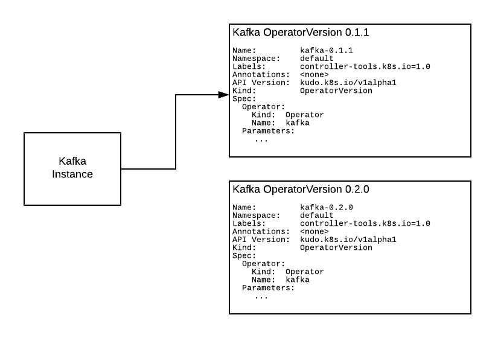
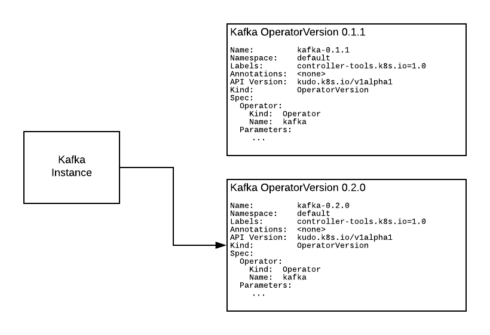

# Upgrading the KUDO Kafka Operator

KUDO Kafka upgrades work by linking the Kafka cluster `Instance` object to the correct `operatorVersion` object.

We can have multiple operator versions in the same Kubernetes cluster. 
One instance object represents a Kafka Cluster and multiple instances can use the same or different operator versions.



Upgrading can be done by patching the Kafka Instance that holds all the configuration of a specific Kafka cluster and pointing it to a new OperatorVersion object.




The following upgrade procedure assumes one running Kafka cluster and one Kafka operator version already installed (version `kafka-0.1.2`). It also assumes one is running KUDO 0.5.0 or later:

Check for running instances:

```
$ kubectl get instances
NAME             AGE
kafka-instance   29h
```

We can check the plan status of our Kafka cluster `kafka-instance` with:
```
$ kubectl kudo plan status --instance=kafka-instance
Plan(s) for "kafka-instance" in namespace "default":
.
└── kafka-instance (Operator-Version: "kafka-1.1.0" Active-Plan: "deploy")
    ├── Plan deploy (serial strategy) [COMPLETE]
    │  └── Phase deploy-kafka [COMPLETE]
    │    └── Step deploy (COMPLETE)
    └── Plan not-allowed (serial strategy) [NOT ACTIVE]
        └── Phase not-allowed (serial strategy) [NOT ACTIVE]
            └── Step not-allowed (serial strategy) [NOT ACTIVE]
                └── not-allowed [NOT ACTIVE]
```
**Note:** the operator version is `kafka-1.1.0`

To update the Kafka cluster from version `0.1.2` to `0.2.0`:

```
$ kubectl kudo upgrade kafka --operator-version=1.2.1 --instance kafka-instance

operator.kudo.dev/kafka unchanged
operatorversion.kudo.dev/v1beta1/kafka-1.2.1 created
```
Now there are two operator versions installed:
```
kubectl  get operatorversions.kudo.k8s.io

NAME              AGE
kafka-1.1.0       2d2h
kafka-1.2.1       2m6s
```

Check the plan status again:

```
$ kubectl kudo plan status --instance=kafka-instance
Plan(s) for "kafka-instance" in namespace "default":
.
└── kafka-instance (Operator-Version: "kafka-1.2.1" Active-Plan: "deploy")
    ├── Plan deploy (serial strategy) [IN_PROGRESS]
    │   └── Phase deploy-kafka (serial strategy) [COMPLETE]
    │       ├── Step configuration [COMPLETE]
    │       ├── Step service [COMPLETE]
    │       ├── Step app [COMPLETE]
    │       └── Step addons [COMPLETE]
    ├── Plan external-access (serial strategy) [NOT ACTIVE]
    │   └── Phase external-access-resources (serial strategy) [NOT ACTIVE]
    │       └── Step external [NOT ACTIVE]
    ├── Plan mirrormaker (serial strategy) [NOT ACTIVE]
    │   └── Phase deploy-mirror-maker (serial strategy) [NOT ACTIVE]
    │       └── Step deploy [NOT ACTIVE]
    ├── Plan not-allowed (serial strategy) [NOT ACTIVE]
    │   └── Phase not-allowed (serial strategy) [NOT ACTIVE]
    │       └── Step not-allowed [NOT ACTIVE]
    └── Plan service-monitor (serial strategy) [NOT ACTIVE]
        └── Phase enable-service-monitor (serial strategy) [NOT ACTIVE]
            └── Step add-service-monitor [NOT ACTIVE]
```

**Note:** the operator-version is now `kafka-1.2.1` meaning the Kafka Operator has been successfully upgraded.

